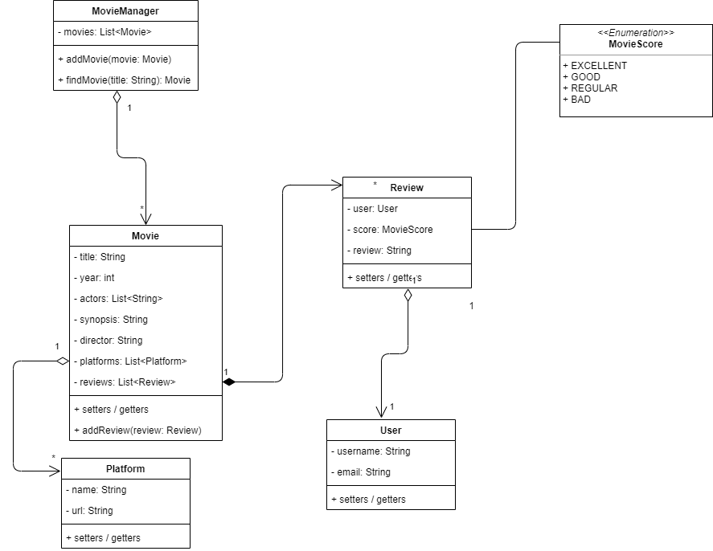

# Primer examen parcial de Objetos 2021-A

Queremos crear una aplicación que nos permita a múltiples usuarios escribir reseñas (reviews) de películas.

De cada película queremos saber:
-	Título
-	Año en que fue lanzada
-	Quién sale en la película (actores)
-	Sinopsis
-	Director
-	Plataformas en las que aparece (Netflix, Dinsey+, Prime Video, etc)

Cada película puede tener múltiples reseñas y cada una debe incluir:
-	Nombre del usuario que hace el review
-	Review (texto de la reseña)
-	Calificación (EXCELENTE, BUENA, REGULAR, MALA)

Del usuario se sabe su nickname y su correo electrónico.

De los actores, se guarda solo su nombre.

De los directores, se guarda solo su nombre.

De las plataformas se guarda:
-	Nombre
-	Página principal

Las operaciones que los usuarios pueden realizar son:
-	Buscar película por nombre de la película
-	Ver todas las reseñas de una película
-	Añadir reseña a una película

> NOTA: Para esta aplicación suponemos que los títulos de las películas no se repiten (es decir, son únicos)

## Instrucciones:
1. Leer bien el requerimiento (arriba)
1. Leer detenidamente las instrucciones completas **ANTES** de empezar a crear código
1. Contestar preguntas en el archivo [questions.md](questions.md)
1. Hacer que el main se ejecute correctamente implementando las clases mostradas en el siguiente diagrama 
   - IMPORTANTE: **No está permitido modificar el main** 
1. Al ejecutar el programa la salida es:
```shell
El señor de los anillos  - La comunidad del anillo - 2001
Director: Peter Jackson
Reparto: Ian McKellen,Elijah Wood,Orlando Bloom,Sean Astin,Viggo Mortensen
Plataformas: Netflix
Reviews:
  Sin reviews
============================================================================
Harry Potter y la piedra filosofal - 2001
Director: Chris Columbus
Reparto: Daniel Radcliffe,Emma Watson,Rupert Grint,Richard Harris,Tom Felton
Plataformas: Netflix,Prime Video
Reviews:
> Usuario: Francisco  -   GOOD
El review de Panchito
> Usuario: Guadalupe  -   EXCELLENT
El review de Lupita
============================================================================
Piratas del Caribe: la maldición del Perla Negra - 2003
Director: Gore Verbinski
Reparto: Johnny Depp,Keira Knightley,Orlando Bloom,Geoffrey Rush,Kevin McNally
Plataformas: Disney+
Reviews:
> Usuario: Francisco  -   EXCELLENT
El review de Lupita para Piratas del Caribe
============================================================================
Avengers: Endgame - 2019
Director: Anthony Russo, Joe Russo
Reparto: Chris Evans,Robert Downey Jr.,Chris Hemsworth,Mark Ruffalo,Elizabeth Olsen
Plataformas: Disney+
Reviews:
> Usuario: Francisco  -   EXCELLENT
El review de Panchito para Avengers
============================================================================
```